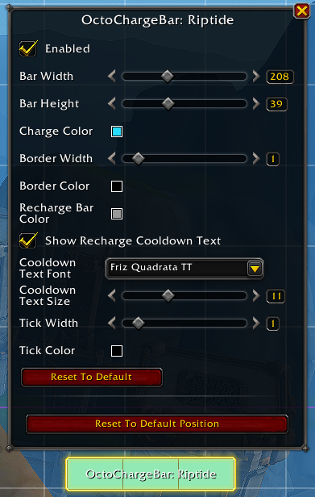

# OctoChargeBar
## What is this?
An addon to display charges of an important spell as a bar. Everything works in combat, but bars must be *initialized* out of combat in order to place tickmarks correctly.
### Example - Riptide

## Spells Currently Tracked
* Augmentation Evoker
  * Hover
  * Prescience
* Devastation Evoker
  * Hover
* Preservation Evoker
  * Hover
* Beast Mastery Hunter
  * Kill Command
  * Barbed Shot
* Arcane Mage
  * Shimmer
* Frost Mage
  * Shimmer
* Fire Mage
  * Fire Blast
  * Shimmer
* Brewmaster Monk
  * Purifying Brew
  * Celestial Brew
  * Keg Smash
  * Roll
* Mistweaver Monk
  * Roll
* Windwalker Monk
  * Roll
* Elemental Shaman
  * Lava Burst
* Restoration Shaman
  * Riptide
  * Lava Burst
* Destruction Warlock
  * Conflaguration
## Configuration
All configuration happens in edit mode. Each bar for your spec will be enabled by default. You can turn off whatever you don't want and tweak whatever you do.

